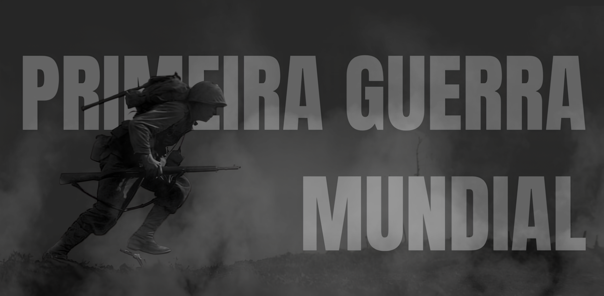
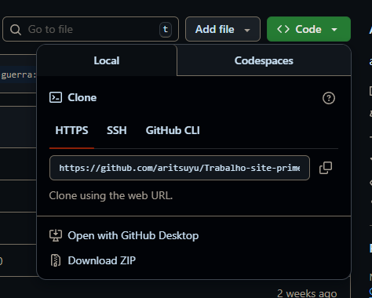
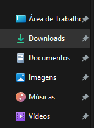
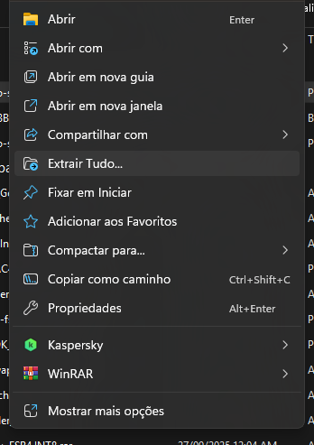

# Site da Primeira Guerra Mundial:



## Este site foi desenvolvido para uma S.A (Situação de Aprendizagem) da materia de Historia.

### Foi utilizado HTML, CSS e JavaScript na programação do site:

- HTML para estruturar o conteúdo e textos
- CSS para estilizar e animações.
- JavaScript para o Quiz, para o carrosel de Filmes/Series e

### Objetivo do Site

- Promover a compreensão  de forma clara os principais eventos e causas da Primeira Guerra Mundial por meio de uma ferramenta digital interativa
- Desenvolver habilidades de FrontEnd
- Disponibilizar uma linha do tempo interativa para facilitar nos estudos
- Mostrar curiosidades, fotos e mapas históricos da época
- Possibilitar interação com quizzes ou perguntas sobre a matéria

### Estrutura do Site

```
Site-Primeira-Guerra-Mundial/
│
├── css/
│   ├── armas.css
│   ├── Batalhas.css
│   └── ... 
│
├── html/
│   ├── armas.html
│   ├── Batalhas.html
│   ├── eua.html
│   └── ...
│
├── js/
│   ├── armas.js
│   ├── eua.js
│   ├── figuras.js
│   ├── quiz.js
│   └── ...
│
├── media/
│   ├── backgrounds/
│   ├── git/
│   ├── home/
│   ├── imgconteudo/
│   ├── midia/
│   │   ├── filmes/
│   │   └── livros/
│   └── ...não
│
├── models/
│   └── ...
│
├── flavicon.ico
├── index.html
└── README.md
```

### Como executar?

Para abrir o site, existem duas formas:

- Usando comandos no terminal com Git Clone, clonando o repositorio e após isso abrindo o arquivo Index.html.
- Baixando o site pelo GitHub em formato ZIP, que você vai ter que extrair antes de abrir

####  Pelo Terminal
```
winget install Git.Git (caso não tenha instalado)
cd Downloads
git clone https://github.com/aritsuyu/Trabalho-site-primeira-guerra
cd Trabalho-site-primeira-guerra
start .
```
e Abra o index.html para vizualizar o site no navegador padrão

#### Pelo Download
1. Clique em Code
2. Após isso em Download ZIP
3. Procure na pasta Downloads (Windows + E)
4. Clique em Extrair Tudo
5. Após extrair vai aparecer uma janela do Explorer e procure pelo arquivo Index.html e abra ele











<<<<<<< Updated upstream
### Creditos
=======
### Creditos
>>>>>>> Stashed changes
